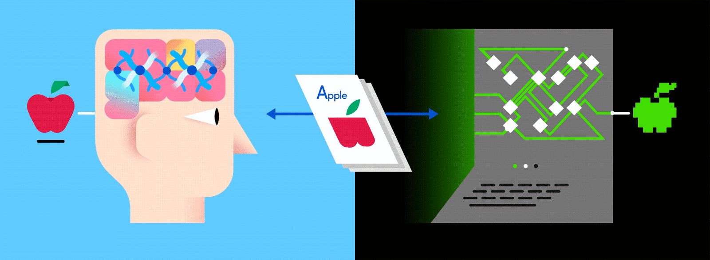

# Breast Cancer Identification - CNN and Transfer Learning

- Breast cancer is the leading cause of cancer-induced mortality among women with 2.6 million and men with 2550 new cases of invasive and in-Situ diagnosed and 40,920 deaths per year.
- To team up with radiologists, we have developed deep learning approaches.
- We have developed a trained model in Convolutional Neural network to ientify the cancer as **BENIGN** or **MALIGNANT**
- To test the approach, we worked with 10, 239 mammographic images having DICOM format downloaded from Cancer Imaging Archives wiki.
- Our framework accurately detected on average 74% of the three results of breast cancer including benign, malignant, and benign without callback.


- With 4 layers of neural networks, we trained our for the Breast Cancer categories.
- With 3 fully connected layers, we demonstrated a transfer learning technique to classify the images and compared the accuracy with CNN model.

## Getting Started:


- This view is an explanation for the process we adopted in this project.

## Prerequisite:

#### Below libraries were used for Python 3.6 (Please refer Dependencies for below libraries)
1. Open CV
2. SciKit
3. Numpy
4. DICOM
5. TensorFlow

## Data Collection and Storage:

- [Dataset](https://wiki.cancerimagingarchive.net/display/Public/CBIS-DDSM#ff820f6094c84e539a4ff537d8b0a7a9) was collected from Curated Breast Imaging Subset of Digital Database for Screening Mammography database.
- It is a database of 2, 620 mammography images which were decompressed and converted to DICOM format.
- Resources on remote server were downloaded through Java Network Launch Protocol (JNLP).
- This dataset has images with 64-bit optical density values collected from 6775 patients who were selected for breast cancer identification.
- This dataset is a collection of Left and Right breast mammograms taken with two image views
  1. Craniocaudal (CC)
  2. Mediolateral Oblique (MLO).
- It comprises 1, 429 Benign cases, 628 Normal cases and 1, 457 Malign cases.

- **Note: Approximately 80% of available data were randomly chosen to construct the training set and the remaining 20% of the data were used for performance evaluation or as a test data.**

## Image Conversion from DICOM to JPEG:

- DICOM files can be difficult to read sometimes.
- Thus, infamous Digital Imaging and Communications in Medicine (DICOM) standard the de-facto solution to storing and exchanging medical image-data can be converted to JPEG format using **PYDICOM** and **SCIPY** library methods.
```
def dicom_jpeg(case_frame):
    for index in range(1206,len(case_frame['ImageFilePath'])):
        ds = dicom.read_file(case_frame['ImageFilePath'][index])
        print(case_frame['ImageFilePath'][index])
        filename = cur_path + '/outcome/Calc_Data/' + str(index) + '.jpg'
        scipy.misc.imsave(filename, ds.pixel_array)
```

- Below two functions are used to convert DICOM to JPEG
  1.	**dicom.read_file** : It reads the complex files into natural pythonic structures for easy manipulation
  2.	**scipy.misc.imsave** : This function uses bytescale under the hood to rescale images to use the full (0, 255) range if mode is one of None, 'L', 'P', 'l'. It will also cast data for 2-D images to uint32 for mode = None

[Each step included in Image Conversion is explained here](https://github.com/palakagrawal912/agrawal_palak_spring18_ads/blob/master/project/analysis/ConvertDICOMToJPEG.ipynb)

## Pre-processing Images:

- Gathering data and converting DICOM to JPEG images is followed by Pre-processing the images for below reasons,
  1.	Extracting boundaries
  2.	Removing Pectoral muscle
  3.	Removing artifact number (LMLO, RCC, etc.)
- OpenCV library is used to support a lot of algorithms related to Computer Vision and Machine Learning.
- All the OpenCV array structures are converted to-and-from Numpy arrays.
- So, whatever operations we can do in Numpy, can be combined with OpenCV to be performed on images.

    

[Each step included in Pre-processing is explained here](https://github.com/palakagrawal912/agrawal_palak_spring18_ads/blob/master/project/analysis/Preprocessing_MamographicImg.ipynb)


### Convolutional Neural Network - Training a model from Scratch:


- The overall training process of the Convolution Network may be summarized as below:
  - Step1: We initialize all filters and parameters / weights with values
  - Step2: The network takes a training image as input, goes through the forward propagation step i.e., convolution, ReLU and pooling operations along with forward propagation in the Fully Connected layer and finds the output for each class.
  - Step3: Calculate the total error at the output layer

  ```
      Total Error = ∑  ½ (target probability – output probability) ²
    ```
    - Step4: Use Backpropagation to calculate the gradients of the error with respect to all weights in the network and use gradient descent to update all filter values / weights and parameter values to minimize the output error.
    - The weights are adjusted in proportion to their contribution to the total error.
    - When the same image is input again, output probabilities will be closer to the target vector.
    - This means that the network has learnt to classify this particular image correctly by adjusting its weights / filters such that the output error is reduced.
    - Parameters like number of filters, filter sizes, architecture of the network etc. have all been fixed before Step 1 and do not change during training process, only the values of the filter matrix and connection weights get updated.
    - Step5: Repeat steps 2-4 with all images in the training set.
- The above steps train the ConvNet – this essentially means that all the weights and parameters of the ConvNet have now been optimized to correctly classify images from the training set.

- **Specification of parameters:**

```
Input layer: (128,128,3)
128 - refers to no. of pixels in each dimension
3 - refers to the RGB values (channels) for each pixel

Layer 1:
Conv-1: 16 filters of size 3 x 3 with ReLU activated
Pool-1: Max pool with pool_size 1
Batch-1

Layer 2:
Conv-2: 32 filters of size 3 x 3 with ReLU activated
Pool-2: Max pool with pool_size 2
Batch-2

Layer 3:
Conv-3: 64 filters of size 3 x 3 with ReLU activated
Pool-3: Max pool with pool_size 2
Batch-3

Layer 4:
Conv-4: 128 filters of size 3 x 3 with ReLU activated
Pool-4: Max pool with pool_size 1
Batch-4

Batch Size: 32
Dropout: 50%
FC-1: 128 neurons with activation function ReLU

Accuracy achieved - 72.17%
```

[Each step included in CNN model training is explained here](https://github.com/palakagrawal912/agrawal_palak_spring18_ads/blob/master/project/analysis/BreastCancerIdentification.ipynb)

### Transfer Learning using Inception V3 model:



- Transfer Learning is the use of a Neural Network for classifying images from another data-set than it was trained on.
- We are using reclassification bottleneck to classify our images
- This is a pre-trained Deep Neural Network for classifying images.
- We have provided an image for a jpeg-file which will be loaded and input to the Inception model, which will then output an array of numbers indicating how likely it is that the input-image is of each class.


- **Specification of parameters:**

```
Input layer: (299,299,3)
299 - refers to no. of pixels in each dimension
3 - refers to the RGB values (channels) for each pixel

Fully connected Layer 1:
Weights - 2048
Biases - 1024

Fully connected Layer 2:
Weights - 1024
Biases - 128

Fully connected Layer 3:
Weights - 128
Biases - 1

Accuracy achieved - 74.76%
```

[Each step included in CNN model training is explained here](https://github.com/palakagrawal912/agrawal_palak_spring18_ads/blob/master/project/analysis/BreastCancerIdentification.ipynb)

## Folder Structure:
| **Path**| **Purpose**|
|:-----------:|:------------:|
| project/analysis/*.ipynb | Folder containing all the jupyter notebooks |
| project/data/*.csv | Contains csv file providing details about images |   
| project/data/PreprocessedImages/*.jpg| Contains preprocessed images in JPEG format |
| project/outcome/*.jpg | These are the images generaed as part of preprocessing steps |
| project/outcome/Calc_data/*.jpg | Calcification Images initially converted from DICOM and before preprocessing |
| project/outcome/Mass_data/*.jpg | Mass Images initially converted from DICOM and before preprocessing |
| project/raw_images/*.jpg | Contains images which were required for preparing artifacts or explanation |
| project/artifacts/* | Contains presentation, proposal, reserach paper related to project |


## Dependencies:

#### 1. Open CV             - [Open-CV-Python](https://opencv-python-tutroals.readthedocs.io/en/latest/py_tutorials/py_setup/py_intro/py_intro.html)
```
conda install -c menpo opencv3
```
#### 2. Pydicom                  -  [PYDICOM](https://anaconda.org/conda-forge/pydicom)
```
conda install -c conda-forge pydicom
conda install -c conda-forge/label/broken pydicom
```
#### 5. TensorFlow                  -  [TensorFlow](https://www.dataweekends.com/blog/2017/03/09/set-up-your-mac-for-deep-learning-with-python-keras-and-tensorflow)
```
pip install tensorflow
```

## General Information:

##### Course - INFO 7390 Advances in Data Science

##### Principal Investigator
- Prof. Nick Bear Brown
    - Contact - (ni.brown@northeastern.edu)

##### Associate Investigator
- Mahalakshmi Arunachalam
    - Contact - (arunachalam.m@husky.neu.edu)
- Eugene Cheah
    - Contact - (cheah.eug@husky.neu.edu)
- Balaji Mudaliyar
    - Contact - (mudaliyar.b@husky.neu.edu)
- Neelam Babel
    - Contact - (babelneelam@gmail.com)

##### Author
- Palak Agrawal
    - Contact - (agrawal.pala@husky.neu.edu)
- Ayushi Sachdeva
    - Contact - (sachdeva.ay@husky.neu.edu)
- Vinoth Punniyamoorthy
    - Contact - (punniyamoorthy.v@husky.neu.edu)

##### Geographic Details
- [Northeastern University](http://www.northeastern.edu), Boston, MA - 02115
